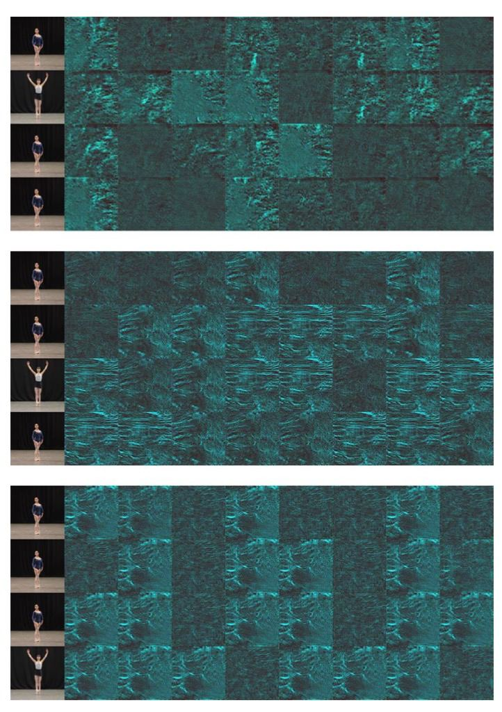
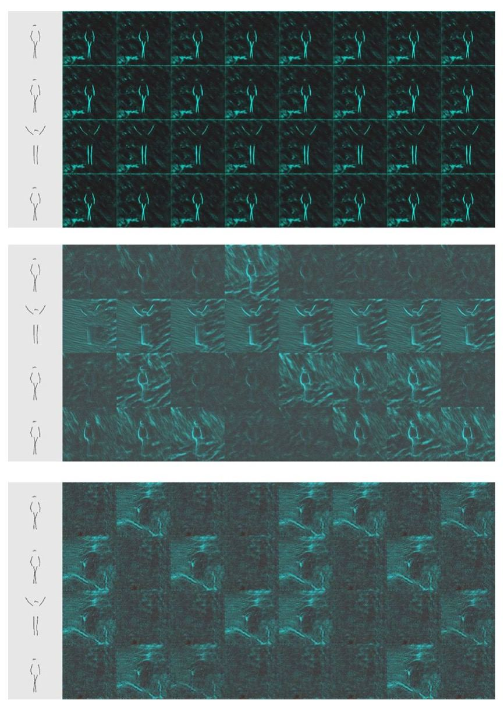

# dance2energy
## Dance energy style transfer using image-to-image translation networks
**Authors:**
Idea & development: [Sofiia Petryshyn](https://github.com/SOFIAshyn). 
Supervisors: 
[Lyubomyr Senyuk](https://www.linkedin.com/in/lyubomyr-sam-senyuk/) and 
[Roman Vey](https://github.com/romanvey).

The project was done as a Thesis for BSc in Computer Science 
in [Ukrainian Catholic University](https://ucu.edu.ua/en/) for [Applied Sciences Faculty](https://apps.ucu.edu.ua/en/faculty/study/cs-ucu-edu-ua/), 
also as an RnD project at [Avenga](https://www.avenga.com/).

**Main idea:**

Dance2Energy is a project that shows the usage of
AlphaPose ML model and represents the idea of 
Generative Art in two senses: algorithmic & intellectual.

**The concept:**
* Algorithmic Generative Art - generation of the dataset based on the
image data, functional calculations, and usage of Perlin noise.
* Intellectual Generative Art - generation of the images based only on the 
paired data input given to the GAN.

**Result:**

The final result of the project is the image translation of 
original images of dancers into energy flow visuals. On the image below
shown the results of the Algorithmic Generative Art. How one original image is 
translated into abstract image.

<p align="center">
    
</p>

In the video below shown the result of Intellectual Generative Art 
generation with Cycle GAN image-to-image translation.

**Press on the image to follow the demo video in YouTube:**
[](https://www.youtube.com/watch?v=ZpkNwWG8qWo)

## Table of Contents
  * [Abstract](#abstract)
    * [Authors](#authors)
    * [Links](#links)
  * [Installation](#installation)
    * [Prerequisites](#prerequisites)
  * [Implementation from scratch](#run-the-project-from-skratch)
    + [Data processing](#data-processing)
    + [Implementation from scratch](#implementation-from-scratch)
      + [Step 1: Take a dataset with people dancing](#step-1-take-a-dataset-with-people-dancing)
      + [Step 2: Get the additional data about images with Pose Estimation Model](#step-2-get-the-additional-data-about-images-with-pose-estimation-model)
      + [Step 3: Generate abstractions dataset based on Pose Estimation data](#step-3-generate-abstractions-dataset-based-on-pose-estimation-data)
      + [Step 4: Visualise data with p5.js](#step-4-visualise-data-with-p5js)
  + [Train or use pre-trained GAN models](#train-or-use-pre-trained-gan-models)
    + [BiCycle GAN](#bicycle-gan)
      + [Original frame 2 Energy flow](#original-frame-2-energy-flow)
      + [Frame skeleton 2 Energy flow](#frame-skeleton-2-energy-flow)
    + [Cycle GAN](#cycle-gan)
  + [Run a frame interpolation model](#run-a-frame-interpolation-model)
  + [Results summary](#results-summary)
  + [Future work](#future-work)
  + [Philosophical idea]()
  + [Citation](#citation)

# Abstract
## Authors
Sofiia Petryshyn, support by Lyubomyr Senyuk and Roman Vey.

## Links
[[Paper]]()
[[Presentation]](https://docs.google.com/presentation/d/16NTiU2i1V95RL4OUrgdiuq0RDwYA9fPu8tz0HFZ0UK4/edit?usp=sharing)
[[Article: Generative Arts]]()
[[Article: Dance GAN. Technical Explanation]]()
[[YouTube: Algoritmic Dance GAN]](https://youtu.be/EjVb_VMo0ns)
[[YouTube: Intellectual Cycle Dance GAN]](https://youtu.be/ZpkNwWG8qWo)

# Installation
## Prerequisites
- Linux or macOS
- Python 3
- CPU or NVIDIA GPU + CUDA CuDNN

- Clone the repository:
   ```bash
   git clone https://github.com/SOFIAshyn/dance2energy.git
   cd dance2energy
   ```
- Install [PyTorch](http://pytorch.org) and 0.4+ and other dependencies (e.g., torchvision, [visdom](https://github.com/facebookresearch/visdom) and [dominate](https://github.com/Knio/dominate)).
  - For pip users, please type the command `pip install -r requirements.txt`.
  - For Conda users, you can create a new Conda environment using `conda env create -f environment.yml`.

If you wish to try out the final result, you should follow [**these instructions**](src/models/pytorch-CycleGAN-and-pix2pix/README.md), if you want to generate the datasets and to try to train BiCycle GAN and Cycle GAN, please follow the instructions below.

# Run the project from skratch
## Data processing
**Steps:**
  - Take a dataset with people dancing
  - Get the additional data about images with Pose Estimation Model
  - Generate abstractions dataset based on Pose Estimation data
  - Visualise data with p5.js

## Implementation from scratch

### Step 1: Take a dataset with people dancing
For the pose estimation of your data, you can follow this notebook 
`alphapose_frames_processing.ipynb`.\
You will get data in `.JSON` format about the keypoints of the bodies at the image.\
\
Otherwise, you can work with dancing dataset:
   - Download the dataset [Let's Dance](https://www.cc.gatech.edu/cpl/projects/dance/).
   - Remain `./data/raw/ballet` folder in data. 
   - Follow the instructions from `alphapose_frames_processing.ipynb`.

\
Running these commands you will get: `./data/interim/json_files_each_video` directory.

An example of the images of the dataset:
<p align="center">
    
</p>

### Step 2: Get the additional data about images with Pose Estimation Model

* Tracking the same pose is done:
   - Run the command
   ```bash
     cd ./src/data/   
     python3 create_pairs_with_optical_flow.py
   ```
   - You will get `./data/interim/df_pairs_each_video` directory as an output.

* To see flow of vectors from one frame to another, run script:
   ```bash
   cd ./src/data/
   python3 vectors_between_frames_visualisation.py   
   ```
An example of the generated vector fields can be seen below:
<p align="center">
    
</p>

* So far we were processing all the `ballet` files. For future GAN usage, 
we will need only the files with one person on the frame. We manually have 
choose the list of directories where only one person is shown. To filter the data, run the script:
   ```bash
   cd ./src/data/
   python3 gan_ballet_image_selector.py
   ```
   You will get data in the directory: `./data/interim/gan_frames`, where each `.JSON` 
file belongs to its directory of the name of the video.

## Step 3: Generate abstractions dataset based on Pose Estimation data

* For future dataset generation with `p5.js` the following data preparation step 
was done: `get_vectors_coordinates_for_p5_js.ipynb`.\
   - Run all the cells, as an output we are getting the following directory: 
`./data/external/p5_df_probs_pairs_5` with `.JSON` file for each video. Each file
describes the flow from one frame to another.
   - Move all the `.JSON` files from this directory into: 
   `./src/visualisation/sketch/assets`.
   
* In `./src/visualisation/sketch` directory is placed the script to generate 
abstraction dataset for processed data with `p5.js`.

An example of the generated abstraction visuals can be seen below:
<p align="center">
    
</p>

## Step 4: Visualise data with p5.js
1. Open `Processsing`. Set up `p5.js` with an editor on the computer. 
2. Open `./src/visualisation/sketch` and run.
   After the run you will get `./data/processed/gan_abstractions` with 
a list of directories of the names of each video.
3. See the comparison of original frame and algorithmically generated 
abstraction image running the cells in 
`./notebooks/abstraction_original_comparison.ipynb`.\
An example of the generated abstraction visuals can be seen below:
<p align="center">
    
</p>

Here you can see the video of the abstractions generated according to the algorithm described above, and merged together with FILM interpolation technique (click on the image):

[](https://www.youtube.com/watch?v=EjVb_VMo0ns)


# Train or use pre-trained GAN models

## BiCycle GAN
The idea is to teach BiCycle GAN to generate abstractions without all the steps above needed. For the instructions, follow [**this link**](src/models/PyTorch-GAN/README.md).
### Original frame 2 Energy flow
Experiments with set up: 
* Size = 128x128, latentdim = 256, batchsize = 8, numepochs = 200
    <p align="center">
        
    </p>
* Size = 256x256, latent dim = 1024, batch size = 8, num epochs = 200
    <p align="center">
        
    </p>

### Frame skeleton 2 Energy flow
Experiments with set up: 
* Size = 128x128, latentdim = 256, batchsize = 8, numepochs = 200
    <p align="center">
        
    </p>
* Size = 256x256, latent dim = 1024, batch size = 8, num epochs = 600
    <p align="center">
        
    </p>

## Cycle GAN
The idea is to teach Cycle GAN to generate abstractions without all the steps above needed. For the instructions, follow [**this link**](src/models/pytorch-CycleGAN-and-pix2pix/README.md).
<p align="center">
    
</p>

# Run a frame interpolation model
For the instructions, please follow [**this link**](src/models/frame-interpolation4large-motion/README.md).
Here you can see the video of the abstractions generated with Cycle GAN, and marged together with FILM interpolation technique (click on the image):

[](https://www.youtube.com/watch?v=ZpkNwWG8qWo)

# Results summary
According to the analysis of the work done, we investigated the Image-to-Image translation problem on images of real life and abstract generated images. We have noticed that if we take a pair of complex images as an input, we need more epochs for a model to learn the patterns of the desired outputs. If the size of images is 256, the pattern of energy flow is learned much better for complex ’dance2energy’ and easier ’danceSkeleton2energy’. The other side of Image-to-Image translation models is the mode collapse problem; BiCycle GAN aims to avoid this problem with the offered architecture. However, what we have noticed is that the network is prone to have a mode collapse, only working in smaller latent space; with the smaller size of image inputs, the model performs better results.

# Future work
To improve results, we need to make changes in architecture; another loss or dis- criminator type doesn’t make a real change. Further steps to explore:
* work with larger datasets 
* try to use larger sizes of images to feed BiCycle GAN and avoid mode collapse • progress with project to be able to generate the visuals in live.

# Philosophical idea
Having a trend of graphical arts, sports, and mindfulness, we decided to show hu- manity the energy flow that they express. The demonstration of the energy flow is the picture that shows the trajectories of a person’s limb movements.

The idea is to represent philosophical views through the prism of technological progress. To reach this aim, we decided to use generative networks that have become very widespread over the last years.

Generative art refers to the creation of art through the use of an autonomous system, so in order to show body impulses, this technology is the best choice.

The energy that person generates while dancing can be either very active or quite stiff. The flow depends on the amplitude and speed of movements. The demonstra- tion of energy can use a lot of different forms, however, we decided to represent it as a cobweb that shares a pattern in the trajectory of limbs.

Since movement can be related to thoughts and feelings, dancing can bring changes to emotions and attitudes almost instantly. Dance therapy with visual observation can succeed a new level of understanding of how one feels like and why they feel this way. It helps live life more consciously, happily, and be more fulfilled.

# Citation
```bash
@InProceedings{
 CastroDance2017,
 author = {Daniel Castro, Steven Hickson, Patsorn Sangkloy, Bhavishya Mittal, Sean Dai, James Hays and Irfan Essa},
 title = {Let's Dance: Learning From Online Dance Videos},
 booktitle = {eprint arXiv:2139179},
 year = {2018},
}
```


