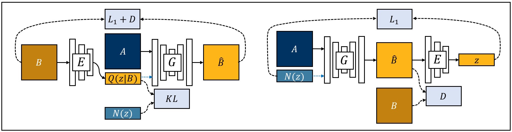
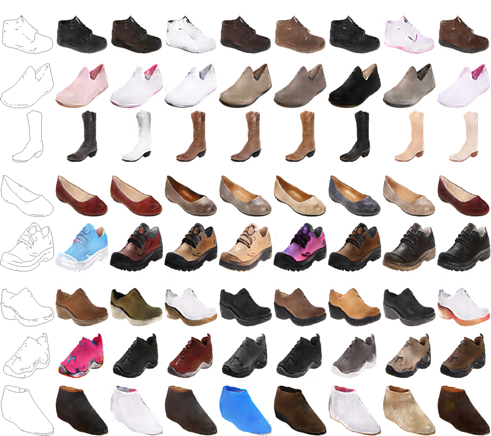

## PyTorch-GAN
A PyTorch implementation of Generative Adversarial Network: BiCycleGAN.

<b>A PyTorch implementation:</b> [PyTorch-GANs](https://github.com/eriklindernoren/PyTorch-GAN)
<b>See also:</b> [Keras-GAN](https://github.com/eriklindernoren/Keras-GAN)

## Table of Contents
  * [Installation](#installation)
  * [Implementations](#implementations)
    + [BicycleGAN](#bicyclegan)

### Installation
    $ cd ./src/PyTorch-GAN/
    $ sudo pip3 install -r requirements.txt

## Implementations   
### BicycleGAN
_Toward Multimodal Image-to-Image Translation_

#### Authors
Jun-Yan Zhu, Richard Zhang, Deepak Pathak, Trevor Darrell, Alexei A. Efros, Oliver Wang, Eli Shechtman

#### Abstract
Many image-to-image translation problems are ambiguous, as a single input image may correspond to multiple possible outputs. In this work, we aim to model a \emph{distribution} of possible outputs in a conditional generative modeling setting. The ambiguity of the mapping is distilled in a low-dimensional latent vector, which can be randomly sampled at test time. A generator learns to map the given input, combined with this latent code, to the output. We explicitly encourage the connection between output and the latent code to be invertible. This helps prevent a many-to-one mapping from the latent code to the output during training, also known as the problem of mode collapse, and produces more diverse results. We explore several variants of this approach by employing different training objectives, network architectures, and methods of injecting the latent code. Our proposed method encourages bijective consistency between the latent encoding and output modes. We present a systematic comparison of our method and other variants on both perceptual realism and diversity.

[[Paper]](https://arxiv.org/abs/1711.11586) [[Code]](implementations/bicyclegan/bicyclegan.py)

<p align="center">
    
</p>

#### Run Example
##### Download the data and train a model
Data downloaded is not cropped and is in the highest quality possible. For 
BiCycle GAN code `ImageDataset` class methods in `datasets.py` / 
`datasets_on_real_images.py` / `datasets_on_skeletons.py` crops the images 
according to the bounding boxes. 
```
$ cd ./src/models/PyTorch-GAN/data/
$ wget https://drive.google.com/file/d/11vFxG-59UzPP-L_FC4gWweoW5-NIxJxg/view?usp=sharing
$ unzip ./dance2energy.zip -d ./
$ cd ../implementations/bicyclegan/
$ python3 bicyclegan.py
```
##### See the results
If you wish to train a model on the datasets that 
After the run, you will see the results in 
`./src/models/PyTorch-GAN/implementations/images` directory.

<p align="center">
    
</p>
<p align="center">
    Various style translations by varying the latent code.
</p>
