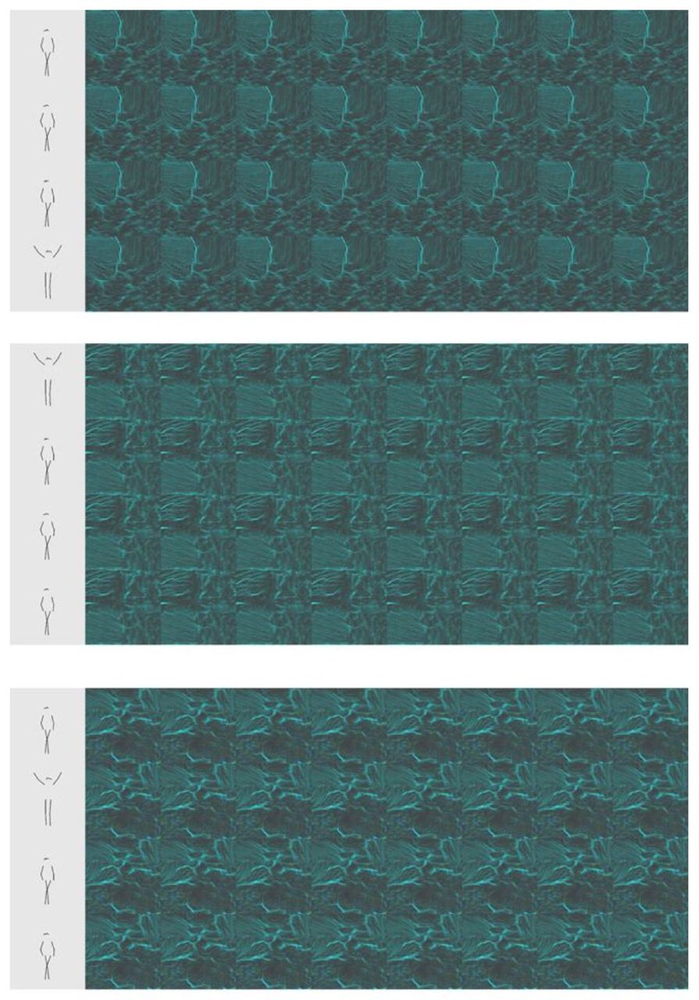

## PyTorch-GAN

<b>A PyTorch implementation:</b> [PyTorch-GANs](https://github.com/eriklindernoren/PyTorch-GAN)

## Table of Contents
  + [Virtual environment setup](#virtual-environment-setup)
  + [BicycleGAN](#bicyclegan)
    + [Abstract](#abstract)
      + [Conditional Variational Autoencoder GAN: cVAE-GAN](#conditional-variational-autoencoder-gan-cvae-gan)
      + [Conditional Latent Regressor GAN: cLR-GAN](#conditional-latent-regressor-gan-clr-gan)
      + [Hybrid Model: BicycleGAN](#hybrid-model-bicyclegan)
    + [Links](#links)
    + [Authors](#authors)
  + [Run Example](#run-example)
    + [Download the data and train a model](#download-the-data-and-train-a-model)
    + [Results](#results)
    + [Experiments](#experiments)
      + [Original frame 2 Energy flow](#original-frame-2-energy-flow)
      + [Frame skeleton 2 Energy flow](#frame-skeleton-2-energy-flow)
  + [Results summary](#results-summary)
  + [Citation](#citation)

## Virtual environment setup
```bash
cd ./src/PyTorch-GAN/
pip3 install -r requirements.txt
```

## BicycleGAN
### Abstract
As usually, GANs train a generator G and discriminator D by formulating their ob- jective as an adversarial game. The generator tries to fool the discriminator with real and fake (generated) images, whereas the discriminator tries to make a proper guess about the input. By objective function the convergence criterion is defined. GANs objective function is written in the way, so discriminator always reply the image fed to it is the real one. This process makes the GAN model generate samples close to real. The formulation is below.

<p align="center">
    
</p>

In this work we modify the model input, so it is fed with four input channels instead of three (defined as ’keypoints’). BiCycle GAN consists of two main parts, that have their objective functions:
* Conditional Variational Autoencoder GAN: cVAE-GAN
* Conditional Latent Regressor GAN: cLR-GAN

#### Conditional Variational Autoencoder GAN: cVAE-GAN
Conditional VAE-GAN architecture is shown below. With the encoder architecture `E` the ground truth `B` is mapped to `z` latent code. After that the generator is fed with the latent code and the paired input `image A` with its additional `channel of keypoints` of the body detected to create `Bˆ`.

<p align="center">
    
</p>

#### Conditional Latent Regressor GAN: cLR-GAN
Conditional LR-GAN architecture visualised below. This architecture takes randomly drawn latent code `z` and attempt to recover it with `zˆ = E(G(A, keypoints, z))`. In this architecture the encoder `E` responsible for the point estimate for `zˆ`.

<p align="center">
    
</p>

##### Hybrid Model: BicycleGAN
BiCycle GAN is the combination of cVAE-GAN and cLR-GAN objectives in a hybrid model. The architecture of modified model with the addition of input channel.

<p align="center">
    
</p>

### Links

[[Paper]](https://arxiv.org/abs/1711.11586) [[Code]](implementations/bicyclegan/bicyclegan.py)

### Authors
Jun-Yan Zhu, Richard Zhang, Deepak Pathak, Trevor Darrell, Alexei A. Efros, Oliver Wang, Eli Shechtman.

## Run Example
### Download the data
Data downloaded is not cropped and is in the highest quality possible. For 
BiCycle GAN code `ImageDataset` class methods in `datasets.py` / 
`datasets_on_real_images.py` / `datasets_on_skeletons.py` crops the images 
according to the bounding boxes.

Install the requirements:
```bash
pip3 install -r requirements.txt.
```

Download and unzip the data:

```bash
cd ./src/models/PyTorch-GAN/data/
wget https://drive.google.com/file/d/11vFxG-59UzPP-L_FC4gWweoW5-NIxJxg/view?usp=sharing ./
unzip ./dance2energy.zip -d ./
```

Examples of pairs given as an input to BiCycle GAN from the dataset ’dance2energy’:

<p align="center">
    
</p>

Examples of pairs of the frames of same video given as an input to BiCycle GAN from the dataset ’dance2energy’.

<p align="center">
    
</p>

### Train a model
Train BiCycle GAN on the dataset downloaded:

```bash
cd ../implementations/bicyclegan/
python3 bicyclegan.py
```
The model is saved in `./implementations/bicyclegan/saved_models`. Model name is the same as the name of the dataset.

### Results 
After the run, you will see the results in 
`./src/models/PyTorch-GAN/implementations/images` directory.

### Experiments
In the results we have the first column being an original image and the other eight columns being different trials of energy flow images generation.

#### Original frame 2 Energy flow
Experiments with set up: 
* Size = 128x128, latentdim = 256, batchsize = 8, numepochs = 200
    <p align="center">
        
    </p>
* Size = 256x256, latent dim = 1024, batch size = 8, num epochs = 200
    <p align="center">
        
    </p>

#### Frame skeleton 2 Energy flow
Experiments with set up: 
* Size = 128x128, latentdim = 256, batchsize = 8, numepochs = 200
    <p align="center">
        
    </p>
* Size = 256x256, latent dim = 1024, batch size = 8, num epochs = 600
    <p align="center">
        
    </p>
  
## Results summary
According to the analysis of the work done, we investigated the Image-to-Image translation problem on images of real life and abstract generated images. We have noticed that if we take a pair of complex images as an input, we need more epochs for a model to learn the patterns of the desired outputs. If the size of images is 256, the pattern of energy flow is learned much better for complex ’dance2energy’ and easier ’danceSkeleton2energy’. The other side of Image-to-Image translation models is the mode collapse problem; BiCycle GAN aims to avoid this problem with the offered architecture. However, what we have noticed is that the network is prone to have a mode collapse, only working in smaller latent space; with the smaller size of image inputs, the model performs better results.

## Citation
```
@article{https://doi.org/10.48550/arxiv.1711.11586,
  doi = {10.48550/ARXIV.1711.11586},
  url = {https://arxiv.org/abs/1711.11586},
  author = {Zhu, Jun-Yan and Zhang, Richard and Pathak, Deepak and Darrell, Trevor and Efros, Alexei A. and Wang, Oliver and Shechtman, Eli},
  keywords = {Computer Vision and Pattern Recognition (cs.CV), Graphics (cs.GR), Machine Learning (stat.ML), FOS: Computer and information sciences, FOS: Computer and information sciences},
  title = {Toward Multimodal Image-to-Image Translation},
  publisher = {arXiv},
  year = {2017},
  copyright = {arXiv.org perpetual, non-exclusive license}
}
```